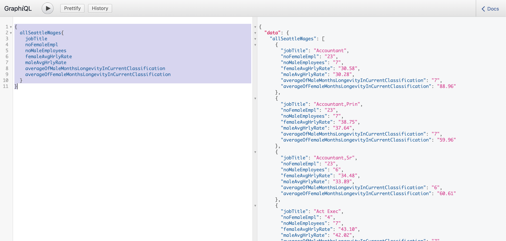

A GraphQL layer for querying seattle wage data

# Test
- click on web link in description
- add query below

      {
            allSeattleWages {  

                  sid  
                  id   
                  position
                  createdAt
                  createdMeta
                  updatedAt
                  updatedMeta
                  meta
                  jobTitle
                  femaleAvgHrlyRate
                  noFemaleEmpl
                  averageOfFemaleMonthsLongevityInCurrentClassification
                  maleAvgHrlyRate
                  noMaleEmployees
                  averageOfMaleMonthsLongevityInCurrentClassification
                  totalAvgHrlyRate
                  totalNoEmpl
                  totalAverageOfMonthsLongevityInCurrentClassification
                  ratioOfWomenHourlyRateToMenHourlyRatePercentage
                  notes    
            }  
      }
